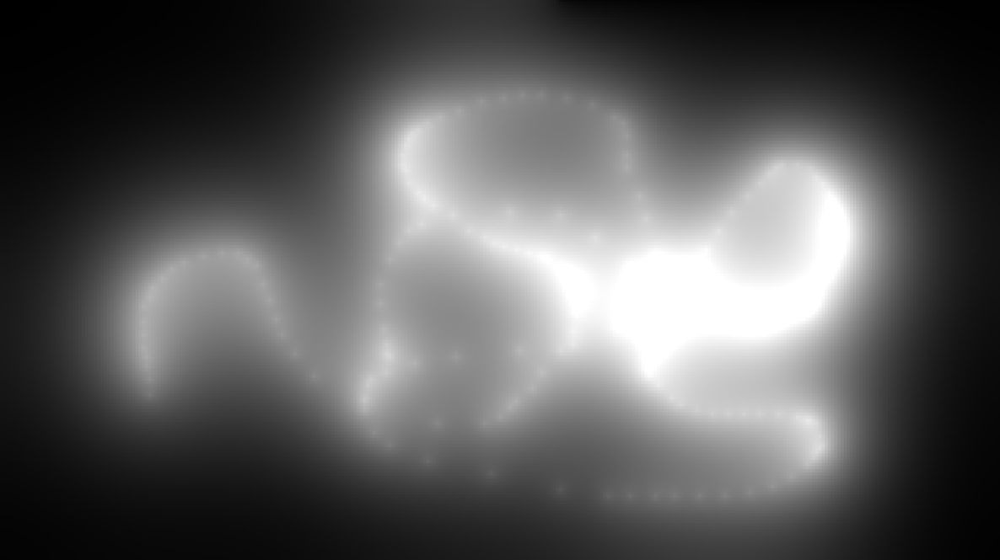

## Navier-Stokes Based Light Simulation

Often in games, we treat light as having infinite speed, displaying the end result of our computations with it instantly. In this repo, I use a Navier-Stokes simulation to explore the opposite: declaring light as an object the user can create, and visualizing how its shape changes over time if we treat it as a high-density, high-velocity fluid.

I referred to [Stam's classic paper](http://graphics.cs.cmu.edu/nsp/course/15-464/Fall09/papers/StamFluidforGames.pdf) on Navier-Stokes fluid simulations for the math, and have used code and inspiration from Muratori's [Handmade Hero](https://hero.handmade.network/) series for things like project organization and performance, down to some finer details like window management and drawing pixels onscreen. Relatedly, I built this from scratch in C++ (the better the performance, the more pixels we can afford to display). I call the [.NET API](https://learn.microsoft.com/en-us/docs/) directly for things like windowing, input, and drawing onscreen, and specify the libraries that I use in a batch file rather than using any external make utilities.

This is a program for Windows, and can be run by cloning this repo and running `build/driver.exe`. 

From here, I'd like to play around to having this density measurement map to somewhere on a HSV scale, rendering this as colored light rather than in greyscale. I'd also be curious to see if we could speed this up by using a more direct method of solving for diffusion, and manually correcting for overflow: the Gauss-Seidel relaxation that I'm currently using is accurate, but at 20 passes per pixel is the biggest performance bottleneck. I would want to further optimize this (alongside adding more error checking and Windows compatibility) before using as any kind of shippable utility.

